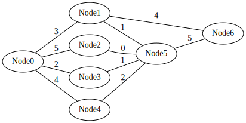

## Handout

- You may obtain a copy of these notes and code samples on my website
- Code samples are in Haskell and were tested on GHC 9.2.4

### Links

- [https://simonzeng.com/tropical.pdf](https://simonzeng.com/tropical.pdf)
- [https://simonzeng.com/tropical.hs](https://simonzeng.com/tropical.hs)

::: notes

- Greeting
- Spoiler: Functional programming talk
  - Not lambda
  - Not purity
  - Not monads
- Solving real problems declaratively
  - Graph problems!
- We develop an algebraic method that elegantly describes a class of graph 
  problems and their solutions
- These notes are available on my website

:::

# Motivating problem

{height=40%}

- Problem: find the number of paths between two nodes on a graph that traverses 
  $n$ edges?
- Example 1: there are 20 paths from node 1 to node 5 that traverse 2 edges
- Example 2: there are 41 paths from node 6 to node 6 that traverse 2 edges 
  (edge reuse allowed)

## Solving imperatively

{height=50%}

- DFS, priority queue, etc
- Works, but a bit painful

::: notes

- Informally go over an imperative DFS
- Do example with $n = 3$

:::

# Towards an elegant solution

{height=50%}

- Example: What exactly are we doing when we want to solve for paths between 0 
  and 5 with $n=2$?
- $Paths(0, 5) = 3\times 1 + 5\times 0 + 2\times 1 + 4\times 2 = 13$

::: notes

- What does this look like? A linear combination!
- It's actually a dot product!

:::

## What does that look like?

{height=50%}

### Solution for $n=4$ as a dot product

$$Paths(0, 5) =(3, 5, 2, 4)\times (1, 0, 1, 2) = 13$$

::: notes

- Explain where the numbers come from

:::

## Expanding it out

{height=50%}

- Actually, there are 0 paths of length 1 between two unconnected nodes, so the 
  full dot product looks like:
$$Paths(0, 5) = (0, 3, 5, 2, 4, 0, 0)\times (0, 1, 0, 1, 2, 0, 5) = 13$$

::: notes

- Explain where the numbers come from again, but with the 0s

:::

## The solution for $n=2$ is a dot product

::: {.block}
### Our previous exmple

$$Paths(0, 5) = (0, 3, 5, 2, 4, 0, 0)\times (0, 1, 0, 1, 2, 0, 5) = 13$$
:::

- If the nodes are labelled $u, v, a, b, c, \cdots$ and edges between nodes $u$ 
  and $v$ are labelled $e_{uv}$, then we have:

$$Paths(u, v) = (e_{ua}, e_{ub}, e_{uc}, \cdots)\times (e_{av}, e_{bv}, e_{cv}, 
\cdots)$$

- The first vector is all the edges that start at $u$
- The second vector is the edges that end at $v$

::: notes

So if the answer is just dot products, what if we want to calculate the number 
of paths between two nodes for the entire graph at once?

A bunch of dot products??? What's that called?

It's a matrix product!
:::

## A global answer

{height=33%}\

\small
- Adjacency Matrix: matrix where $i$th row and $j$th column is weight of edge $ij$
- Consider the adjacency matrix of the graph:
$$a = \begin{bmatrix}
  0 & 3 & 5 & 2 & 4 & 0 & 0 \\
  3 & 0 & 0 & 0 & 0 & 1 & 4 \\
  5 & 0 & 0 & 0 & 0 & 0 & 0 \\
  2 & 0 & 0 & 0 & 0 & 1 & 0 \\
  4 & 0 & 0 & 0 & 0 & 2 & 0 \\
  0 & 1 & 0 & 1 & 2 & 0 & 5 \\
  0 & 4 & 0 & 0 & 0 & 5 & 0 \\
\end{bmatrix}
$$
- Do you spot the $Path(0, 5)$ dot product?
\normalsize

## A global answer

{height=33%}\

To get the correct dot products for every pair of nodes, we can simply 
**square the matrix**:
$$a^2 = 
\begin{bmatrix}
  0 & 3 & 5 & 2 & 4 & 0 & 0 \\
  3 & 0 & 0 & 0 & 0 & 1 & 4 \\
  5 & 0 & 0 & 0 & 0 & 0 & 0 \\
  2 & 0 & 0 & 0 & 0 & 1 & 0 \\
  4 & 0 & 0 & 0 & 0 & 2 & 0 \\
  0 & 1 & 0 & 1 & 2 & 0 & 5 \\
  0 & 4 & 0 & 0 & 0 & 5 & 0 \\
\end{bmatrix}^2 = 
\begin{bmatrix}
54 &  0 &	 0 &  0 &	 0 & 13	& 12 \\
 0 & 26 &	15 &  7 &	14 & 20	&  5 \\
 0 & 15 &	25 & 10 &	20 &  0	&  0 \\
 0 &  7 &	10 &  5 &	10 &  0	&  5 \\
 0 & 14 &	20 & 10 &	20 &  0	& 10 \\
13 & 20 &	 0 &  0 &	 0 & 31	&  4 \\
12 &  5 &	 0 &  5 &	10 &  4	& 41
\end{bmatrix}
$$

## Extending the global answer

- What if we want to find the answer for other $n$?
- Simply **take $a$ to the nth power!**
- Example: $a^5$ represents the number of paths between nodes that 
  traverse exactly 5 edges:
$$a^5 =
\begin{bmatrix}
 1560 &	15608 &	16145 &	7611 &	15222 &	 6580 &	 7045 \\
15608 &	 4480 &	 1600 &	1800 &	 3600 &	 7181 &	12084 \\
16145 &	 1600 &	    0 &	 300 &	  600 &	 5765 &	 5960 \\
 7611 &	 1800 &	  300 &	 280 &	  560 &	 3852 &	 2928 \\
15222 &	 3600 &	  600 &	 560 &	 1120 &	 7704 &	 5856 \\
 6580 &	 7181 &	 5765 &	3852 &	 7704 &	 4680 &	12370 \\
 7045 &	12084 &	 5960 &	2928 &	 5856 &	12370 &	 5080 
\end{bmatrix}
$$
- Lends to efficient implementation via square-and-multiply!

## A more useful answer

- What if we want to know the number of paths that use **less or equal to** $n$ moves, 
  rather than exactly $n$?
- Solution: **replace the diagonals of $a$ with 1**
- Then there will always be a "no-op" action, where staying at the same node 
  counts as a move
- So $a^n$ will give all the number of paths between nodes that use less or 
  equal to $n$ moves

$$a^2 =
\begin{bmatrix}
  1 & 3 & 5 & 2 & 4 & 0 & 0 \\
  3 & 1 & 0 & 0 & 0 & 1 & 4 \\
  5 & 0 & 1 & 0 & 0 & 0 & 0 \\
  2 & 0 & 0 & 1 & 0 & 1 & 0 \\
  4 & 0 & 0 & 0 & 1 & 2 & 0 \\
  0 & 1 & 0 & 1 & 2 & 1 & 5 \\
  0 & 4 & 0 & 0 & 0 & 5 & 1 \\
\end{bmatrix}^2 = 
\begin{bmatrix}
55 &	 6 &	10 &	 4 &	 8 &	13 &	12 \\
 6 &	27 &	15 &	 7 &	14 &	22 &	13 \\
10 &	15 &	26 &	10 &	20 &	 0 &	 0 \\
 4 &	 7 &	10 &	 6 &	10 &	 2 &	 5 \\
 8 &	14 &	20 &	10 &	21 &	 4 &	10 \\
13 &	22 &	 0 &	 2 &	 4 &	32 &	14 \\
12 &	13 &	 0 &	 5 &	10 &	14 &	42 
\end{bmatrix}
$$

# A different problem?

{height=33%}

- Problem: find the **shortest** path between two nodes on a graph
- Traditional ways: Dijkstra, Bellman-Ford, etc.
  - Lots of state, not the most elegant
- Can we do better (or at least cleaner)?\pause\smallskip\textbf{Yes}\pause
- Solution: **the exact same solution as the number of paths problem!**

## Recall the solution

::: {.block}
### The Algorithm

1. Get the adjacency matrix $a$ of the graph
   a. Row $i$, Col $j$ has weight of edge $ij$
   b. Row $i$, Col $j$ has additive identity 0 if node $i$ and $j$ are unconnected
   c. The diagonals are filled with the multiplicative identity 1
2. Take the $n$th power of $a$, for whatever value of $n$ we want to calculate 
   up to
:::

\pause
- If we follow these paths as written, we'll just be solving number of paths 
  again
- Q: How is the same algorithm able to solve shortest path?\pause
- A: **Changing the algebraic structure we work in!**

## Algebraic structure??

- In the shortest path problem, we were working in $\mathbb{N}$
- $\mathbb{N}$ has a lot of properties, but what did we actually use?\pause
  - Addition
  - Multiplication
  - Additive identity
  - Multiplicative identity
  - Related laws (i.e. associativity, distributivity, etc)\pause
- An algebraic structure that has these properties is called a 
  **semiring**\pause
- Matrices over a semiring also form a semiring\pause
- We can run our graph algorithm with **any** semiring

## So what semiring will help us solve shortest path?

{height=33%}

- Example: how do we get the shortest distance between node 0 and node 5?\pause
- Answer: $Shortest(0, 5) = min(3 + 1, 5 + 0, 2 + 1, 4 + 2) = 3$\pause
- Compare to the number of paths problem: $Paths(0, 5) = 3\times 1 + 5\times 0 + 2\times 1 + 4\times 2 = 13$\pause
- If you replace multiplication with addition, and addition with $min$, then you 
  can convert between these!

## Introducing the tropical semiring

::: {.block}
### Defining a semiring

Definition

:    A **semiring** is a 3-tuple $(S, +, \times)$ of a set $S$ and binary 
operators $+, \times$ such that $\forall a, b, c \in S$ the following laws hold:

1. Commutivity of $+$: $a + b = b + a$
2. Associativity of $+$: $a + (b + c) = (a + b) + c$
3. Additive identity: $\exists 0 \in S, a + 0 = a$
4. Associativity of $\times$: $a\times (b\times c) = (a\times b)\times c$
5. Multiplicative identity: $\exists 1 \in S, a\times 1 = 1\times a = 1$
6. Multiplying by additive identity: $a\times 0 = 0\times a = 0$
7. Distributivity 1: $a\times (b+c) = a\times b + a\times c$
8. Distributivity 2: $(a+b)\times c = a\times c + b\times c$
:::

The **Tropical Semiring** is the semiring $(\mathbb{N}\cup\{\infty\}, min, +)$ 

- Additive identity is $\infty$
- Multiplicative identity is $0 \in \mathbb{N}$

## The Tropical Semiring Solves Shortest Path

{height=33%}

- Recall: $Shortest(0, 5) = min(3 + 1, 5 + 0, 2 + 1, 4 + 2) = 3$\pause
- Written with the tropical semiring: 
$$Shortest(0, 5)=3\times 1 + 5\times 0 + 2\times 1 + 4\times 2 = 3$$
$$=(3, 5, 2, 4)\cdot (1, 0, 1, 2)$$
- **Dot products just work!**
- Hence, powers of the adjacency matrix just work as well!

## Constructing our adjacency matrix

::: {.block}
### The Algorithm

1. Get the adjacency matrix $a$ of the graph
   a. Row $i$, Col $j$ has weight of edge $ij$
   b. Row $i$, Col $j$ has additive identity $O$ if node $i$ and $j$ are unconnected
   c. The diagonals are filled with the multiplicative identity $I$
2. Take the $n$th power of $a$, for whatever value of $n$ we want to calculate 
   up to, **under whatever semiring solves our problem**
:::
$$a =
\begin{bmatrix}
  I & 3 & 5 & 2 & 4 & O & O \\
  3 & I & O & O & O & 1 & 4 \\
  5 & O & I & O & O & 0 & O \\
  2 & O & O & I & O & 1 & O \\
  4 & O & O & O & I & 2 & O \\
  O & 1 & 0 & 1 & 2 & I & 5 \\
  O & 4 & O & O & O & 5 & I \\
\end{bmatrix}
= \begin{bmatrix}
  0 & 3 & 5 & 2 & 4 & \infty & \infty \\
  3 & 0 & \infty & \infty & \infty & 1 & 4 \\
  5 & \infty & 0 & \infty & \infty & 0 & \infty \\
  2 & \infty & \infty & 0 & \infty & 1 & \infty \\
  4 & \infty & \infty & \infty & 0 & 2 & \infty \\
  \infty & 1 & 0 & 1 & 2 & 0 & 5 \\
  \infty & 4 & \infty & \infty & \infty & 5 & 0 \\
\end{bmatrix}
$$

## Solving shortest path

$$a^{\text{num edges + 1}}
= \begin{bmatrix}
  0 & 3 & 5 & 2 & 4 & \infty & \infty \\
  3 & 0 & \infty & \infty & \infty & 1 & 4 \\
  5 & \infty & 0 & \infty & \infty & 0 & \infty \\
  2 & \infty & \infty & 0 & \infty & 1 & \infty \\
  4 & \infty & \infty & \infty & 0 & 2 & \infty \\
  \infty & 1 & 0 & 1 & 2 & 0 & 5 \\
  \infty & 4 & \infty & \infty & \infty & 5 & 0 \\
\end{bmatrix}^{11}
$$
$$
= \begin{bmatrix}
0 & 3 & 3 & 2 & 4 & 3 & 7 \\
3 & 0 & 1 & 2 & 3 & 1 & 4 \\
3 & 1 & 0 & 1 & 2 & 0 & 5 \\
2 & 2 & 1 & 0 & 3 & 1 & 6 \\
4 & 3 & 2 & 3 & 0 & 2 & 7 \\
3 & 1 & 0 & 1 & 2 & 0 & 5 \\
7 & 4 & 5 & 6 & 7 & 5 & 8
\end{bmatrix}
$$

## Choose your character

By selecting different semirings, we can use this same algorithm to solve 
multiple different problems:

- Connectedness: $(\mathbb{Z}_2, +, *)$
- Longest path: $(\mathbb{N}\cup\{-\infty\}, max, +)$
- Widest flow: $(\mathbb{N}\cup\{-\infty, \infty\}, max, min)$
- Dfa $\to$ Regex: $(\text{Strings}, \text{Or}, \text{concat})$

The following are left as an exercise:

- Determine graph is bipartite
- Inverting matrices
- Knapsack problem

## The end

Thanks for listening!

## Extra note: getting closure

::: {.block}
### Closure

Definition

:    The **closure** of semiring element $a$, written as $a^*$, is defined as 
     the fixed point:

$$a^* = 1 + a\times a^*$$
You can think of it as:
$$a^* = 1 + a + a^2 + a^3 + a^4 + a^5 + \cdots$$
:::

**There exists a closed form solution for closure of a semiring matrix**

For DFA to regex and a few other problems on the last list, you need to 
calculating the closure of a matrix instead of a big power.
